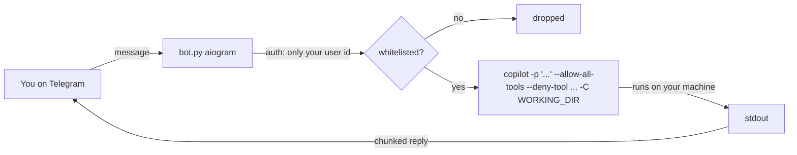

# copilot-telegram-bridge

> Talk to the official **GitHub Copilot CLI** from Telegram. Your coding agent
> keeps working on your machine while you step away from the keyboard.

Send a message to your own private bot and the real `copilot` agent runs
**locally**, inside a project folder you choose, and streams the result back to
your chat. Step away for coffee, keep shipping from your phone.

<!-- Drop a 15-30s screen recording / GIF of a real session here. This is the hook. -->
<!--  -->

---

## Why

The "control your coding agent from your phone" idea is everywhere for Slack and
for Claude Code — but almost nobody wires it to **Telegram** *and* to the
**official GitHub Copilot CLI**, and most bridges are careless about security.
This one is deliberately small, single-user, and guard-railed by default.

- **It's the real agent.** It spawns the actual `copilot` binary (same models,
  same tools). No token scraping, no reimplemented agent loop.
- **Windows-first.** Built and tested on Windows with PowerShell.
- **Security is the point** (see below), not an afterthought.

## Features

- 🔒 **Single-user whitelist** — the bot ignores every Telegram id except yours.
- 📁 **Sandboxed** — Copilot is launched with `-C <WORKING_DIR>`, so it stays in
  one project directory.
- 🧨 **Destructive-command denylist** — `--deny-tool` is always enforced and
  takes precedence over `--allow-all-tools` (`rm`, `del`, `git push`, `sudo`,
  `shutdown`, …).
- 🧵 **Long output** is chunked to fit Telegram, with a live typing indicator.
- 🧱 **Robust launch** — the CLI is invoked via `node <cli.js>`, so prompts full
  of quotes, `&&`, `%` and pipes are never mangled by a Windows `.cmd` shim.

## How it works



## Requirements

- [GitHub Copilot CLI](https://docs.github.com/en/copilot/how-tos/set-up/install-copilot-cli)
  (`npm install -g @github/copilot`) and an active Copilot subscription
- Node.js 20+ and Python 3.10+
- A Telegram bot token from [@BotFather](https://t.me/botfather)

## Quickstart (Windows / PowerShell)

```powershell
# 1. Log the Copilot CLI in (one time)
copilot            # then type /login and follow the browser flow, then /exit

# 2. Clone & install
git clone https://github.com/<you>/copilot-telegram-bridge.git
cd copilot-telegram-bridge
python -m venv .venv
.\.venv\Scripts\Activate.ps1
pip install -r requirements.txt

# 3. Configure
Copy-Item .env.example .env
#   edit .env: TELEGRAM_BOT_TOKEN, ALLOWED_USER_ID, WORKING_DIR

# 4. Run
python bot.py
```

Then message your bot on Telegram. Try: *"list the files here and summarize the
project"*.

## Configuration

| Variable | Required | Description |
| --- | --- | --- |
| `TELEGRAM_BOT_TOKEN` | ✅ | Token from @BotFather |
| `ALLOWED_USER_ID` | ✅ | Your numeric Telegram id (from @userinfobot). Only this id is served |
| `WORKING_DIR` | ⬜ | Copilot's sandbox directory. Defaults to `./workspace` |
| `COPILOT_MODEL` | ⬜ | e.g. `claude-sonnet-4.5`, `gpt-5`. Empty = default |
| `ALLOW_ALL_TOOLS` | ⬜ | `true`/`false`. Needed for headless (unattended) runs |
| `COPILOT_DENY_TOOLS` | ⬜ | Comma-separated tools Copilot may never use |
| `REQUEST_TIMEOUT` | ⬜ | Seconds before a request is killed (default 900) |

## Security model — read this

This bridge lets an AI agent **execute commands on your computer**, triggered by
Telegram messages. Treat it accordingly:

- **Only your user id** is served; everything else is dropped silently.
- Copilot runs **inside `WORKING_DIR`** — point it at a project, never your home
  or system root.
- The **denylist** blocks destructive commands even in `--allow-all-tools` mode.
- **Never send secrets** through the chat.
- For maximum isolation, run inside a VM/container, or use Copilot's own
  `/sandbox`. Set `ALLOW_ALL_TOOLS=false` for an approval-per-action posture, or
  add `--deny-tool='write'` (via a code tweak) for a read-only assistant.
- If your Telegram account is compromised, so is this machine. Use 2FA.

## Roadmap

- 🎤 Voice notes → transcription → prompt (Whisper)
- 🧠 Session continuity (`--continue` / `--resume`) for multi-turn chats
- ✅ Optional Telegram approval prompt for individual tool calls
- 🐧 Linux/macOS launch scripts

## Disclaimer

Personal tool. Not affiliated with GitHub or Anthropic. You are responsible for
what the agent does on your machine. MIT licensed — see [LICENSE](LICENSE).
