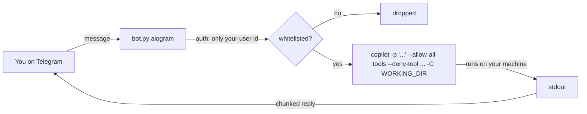

# copilot-telegram-bridge

> Talk to the official **GitHub Copilot CLI** from Telegram. Your coding agent
> keeps working on your machine while you step away from the keyboard.

Send a message to your own private bot and the real `copilot` agent runs
**locally**, inside a project folder you choose, and streams the result back to
your chat. Step away for coffee, keep shipping from your phone.


---

## Why

The "control your coding agent from your phone" idea is everywhere for Slack and
for Claude Code — but almost nobody wires it to **Telegram** *and* to the
**official GitHub Copilot CLI**, and most bridges are careless about security.
This one is deliberately small, single-user, and guard-railed by default.

- **It's the real agent.** It spawns the actual `copilot` binary (same models,
  same tools). No token scraping, no reimplemented agent loop.
- **Windows-first.** Built and tested on Windows with PowerShell.
- **Security is the point** (see below), not an afterthought.

## Features

- 🔒 **Single-user whitelist** — the bot ignores every Telegram id except yours.
- 📁 **Sandboxed** — Copilot is launched with `-C <WORKING_DIR>`, so it stays in
  one project directory.
- 🧨 **Destructive-command denylist** — `--deny-tool` is always enforced and
  takes precedence over `--allow-all-tools` (`rm`, `del`, `git push`, `sudo`,
  `shutdown`, …).
- 🧵 **Long output** is chunked to fit Telegram, with a live typing indicator.
- 🧱 **Robust launch** — the CLI is invoked via `node <cli.js>`, so prompts full
  of quotes, `&&`, `%` and pipes are never mangled by a Windows `.cmd` shim.
- 🎤 **Voice notes** are transcribed locally with Whisper (`faster-whisper`) —
  no API key, nothing leaves your machine.
- 🧠 **Conversation continuity** — context carries across messages via
  `--continue`; `/new` starts a fresh session.
- 📱 **Tap-friendly menu** — a `☰ Menu` button and inline keyboards for
  switching workspace, resuming a session, and toggling reply mode, so you
  rarely need to type a command.
- 📁 **Workspace picker** — jump between project subfolders under
  `WORKING_DIR` without editing `.env`.
- 🗂️ **Session picker** — browse and resume any recent Copilot CLI session
  (`~/.copilot/session-state`) instead of always continuing the latest one.
- 💬 **Brief vs. raw replies** — `/brief` asks the agent for a short,
  phone-friendly summary while it still does the full work; `/raw` gives you
  the unabridged CLI output.
- 🖥️ **VS Code bridge (optional)** — a companion VS Code extension
  (`extension/`) lets you send Telegram prompts straight into a real VS Code
  Copilot Chat session instead of the headless CLI, and exposes a
  `notify_telegram` language-model tool so the agent can push status updates
  and questions back to your phone. Toggle it with the menu's **Target**
  button or `VSCODE_MODE=true`.
- 🎭 **Personas** — pick how the agent talks to you (friendly, blunt critic,
  obsessive perfectionist, or terse) from the menu.
- 🧹 **Clear chat** — a `🧹 Clear` bottom-bar button wipes your prompts and the
  bot's replies from the Telegram chat while keeping the menu intact.
- 📱 **One-click connect** — the VS Code extension adds a `📱 Phone` status-bar
  toggle, so you connect the window you're already working in with a single
  click (no F5, no extra window).

## How it works



## Requirements

- [GitHub Copilot CLI](https://docs.github.com/en/copilot/how-tos/set-up/install-copilot-cli)
  (`npm install -g @github/copilot`) and an active Copilot subscription
- Node.js 20+ and Python 3.10+
- A Telegram bot token from [@BotFather](https://t.me/botfather)

## Quickstart (Windows / PowerShell)

```powershell
# 1. Log the Copilot CLI in (one time)
copilot            # then type /login and follow the browser flow, then /exit

# 2. Clone & install
git clone https://github.com/<you>/copilot-telegram-bridge.git
cd copilot-telegram-bridge
python -m venv .venv
.\.venv\Scripts\Activate.ps1
pip install -r requirements.txt

# 3. Configure
Copy-Item .env.example .env
#   edit .env: TELEGRAM_BOT_TOKEN, ALLOWED_USER_ID, WORKING_DIR

# 4. Run
python bot.py
```

Then message your bot on Telegram. Try: *"list the files here and summarize the
project"*, or just tap `☰ Menu` to explore workspaces, sessions and modes.

## Commands & menu

| Command | Does |
| --- | --- |
| `/start`, `/menu` | Show the tap-friendly menu (workspace, sessions, mode, target, new chat, help) |
| `/workspace` | Pick which project subfolder the agent works in |
| `/sessions` | Browse and resume a recent Copilot CLI session |
| `/status` | Show current workspace, session, model, tools and reply mode |
| `/new` | Reset conversation context |
| `/brief` | Short, phone-style summaries (default) |
| `/raw` | Full, unabridged Copilot CLI output |
| `/help` | This list |

Bottom-bar buttons (from the persistent keyboard): **☰ Menu** reopens the menu,
**🧹 Clear** wipes the chat. Inside the menu you can also switch **🎭 Persona**,
flip **🎯 Target** (CLI ⇄ VS Code) and start a **🆕 New chat**.

## Configuration

| Variable | Required | Description |
| --- | --- | --- |
| `TELEGRAM_BOT_TOKEN` | ✅ | Token from @BotFather |
| `ALLOWED_USER_ID` | ✅ | Your numeric Telegram id (from @userinfobot). Only this id is served |
| `WORKING_DIR` | ⬜ | Copilot's sandbox directory. Defaults to `./workspace` |
| `COPILOT_MODEL` | ⬜ | e.g. `claude-sonnet-4.5`, `gpt-5`. Empty = default |
| `ALLOW_ALL_TOOLS` | ⬜ | `true`/`false`. Needed for headless (unattended) runs |
| `COPILOT_DENY_TOOLS` | ⬜ | Comma-separated tools Copilot may never use |
| `REQUEST_TIMEOUT` | ⬜ | Seconds before a request is killed (default 900) |
| `CONTINUE_SESSION` | ⬜ | Keep context across messages (default `true`) |
| `ENABLE_VOICE` | ⬜ | Transcribe voice notes with local Whisper (default `true`) |
| `WHISPER_MODEL` | ⬜ | `tiny`/`base`/`small`/`medium`/`large-v3` (default `small`) |
| `WHISPER_LANGUAGE` | ⬜ | Force a language (e.g. `ru`). Empty = auto-detect |
| `SUMMARY_MODE` | ⬜ | Reply with a short phone summary instead of raw output (default `true`), toggled by `/brief` and `/raw` |
| `SUMMARY_INSTRUCTION` | ⬜ | Override the instruction used to steer brief-mode replies |
| `VSCODE_MODE` | ⬜ | `true` to route prompts to VS Code Copilot Chat instead of the headless CLI (default `false`), toggled by the menu's Target button |
| `BRIDGE_URL` | ⬜ | Local endpoint the VS Code extension listens on (default `http://127.0.0.1:8765`) |
| `NOTIFY_PORT` | ⬜ | Local port the bot listens on for extension notifications (default `8766`) |
| `BRIDGE_TOKEN` | ⬜ | Shared secret between the bot and the extension. Empty = no auth (localhost only) |

## VS Code mode — drive your real Copilot Chat

Instead of the headless CLI, you can send Telegram prompts **straight into a
live VS Code Copilot Chat session**. You watch the full reasoning and diffs in
VS Code as usual, and the agent pings your phone (via a `notify_telegram` tool)
when it finishes or needs a decision. Replies like this README's demo arrive on
your phone exactly this way.

```text
Telegram  ⇄  bot.py (notify server :8766)  ⇄  localhost  ⇄  VS Code extension (:8765)  ⇄  Copilot Chat
```

### 1. Build the extension

```powershell
cd extension
npm install
npm run compile
```

### 2. Install it into your normal VS Code

Package and install (recommended, gives you a real installed extension):

```powershell
npx @vscode/vsce package
code --install-extension copilot-telegram-bridge-ext-0.0.1.vsix
```

…or just copy `package.json` + the compiled `out/` folder into
`%USERPROFILE%\.vscode\extensions\copilot-telegram-bridge-ext-0.0.1\` and
restart VS Code. (For development you can instead press **F5** to launch an
Extension Development Host.)

### 3. Connect the window you work in

After restarting VS Code you'll see a **📱 Phone: ON/OFF** item in the status
bar. Open the workspace you want to drive and click it → **ON**. That window now
receives your phone prompts. Only one window can own the bridge at a time; click
again to release it.

### 4. Point the bot at VS Code

Set `VSCODE_MODE=true` in `.env` (or tap **🎯 Target** in the menu). Keep the
ports and token matching on both sides:

| Bot (`.env`) | Extension (VS Code settings) |
| --- | --- |
| `BRIDGE_URL=http://127.0.0.1:8765` | `copilotTgBridge.port = 8765` |
| `NOTIFY_PORT=8766` | `copilotTgBridge.notifyUrl = http://127.0.0.1:8766/notify` |
| `BRIDGE_TOKEN=<secret>` | `copilotTgBridge.token = <same secret>` |

### 5. Approve the notify tool once

The first time the agent calls `notify_telegram`, VS Code shows a confirmation —
click **Always Allow** so future pings are silent.

That's it: **talk from your phone → the agent works in your VS Code chat → you
get a short ping when it's done.**

### Notes & limits

- Prompts go into the **currently active** chat, so a conversation continues
  naturally. Tap **🆕 New chat** to start a fresh one.
- Picking a specific **past** VS Code chat from the phone isn't possible — VS
  Code doesn't expose that API. Use the desktop **"Chat: Show Chats…"** picker;
  the phone then continues whatever chat is active.
- VS Code must be open for this mode. If the bridge is unreachable the bot tells
  you, and you can fall back to CLI mode with **🎯 Target**.

## Security model — read this

This bridge lets an AI agent **execute commands on your computer**, triggered by
Telegram messages. Treat it accordingly:

- **Only your user id** is served; everything else is dropped silently.
- Copilot runs **inside `WORKING_DIR`** — point it at a project, never your home
  or system root.
- The **denylist** blocks destructive commands even in `--allow-all-tools` mode.
- **Never send secrets** through the chat.
- For maximum isolation, run inside a VM/container, or use Copilot's own
  `/sandbox`. Set `ALLOW_ALL_TOOLS=false` for an approval-per-action posture, or
  add `--deny-tool='write'` (via a code tweak) for a read-only assistant.
- If your Telegram account is compromised, so is this machine. Use 2FA.

## Roadmap

- 🗣️ Voice replies (text-to-speech notes back)
- 📝 Audit log of every prompt and action
- 🚦 Per-hour request / AI-credit cap
- ✅ Optional Telegram approval prompt for individual tool calls
- 🐧 Linux/macOS launch scripts

## FAQ

### Can I control GitHub Copilot from my phone?

Yes. This is a self-hosted Telegram bot that drives the official GitHub Copilot
agent on your own machine, so you can send prompts and get results from your
phone while the real agent edits files and runs commands locally.

### Does it work with the Copilot CLI and with VS Code?

Both. By default it spawns the headless GitHub Copilot CLI. With the optional
companion extension it can instead send your Telegram prompts straight into a
live VS Code Copilot Chat session and ping your phone back when the agent is
done.

### Is it safe to let an AI coding agent run commands from Telegram?

It is a real remote-execution surface, so the bridge is single-user by design:
only your Telegram id is served, the agent is sandboxed to one project folder,
and a destructive-command denylist is always enforced. Read the security section
before exposing it.

### Do I need an API key to use voice messages?

No. Voice notes are transcribed locally with Whisper (`faster-whisper`); nothing
leaves your machine and no speech-to-text API key is required.

### Which platforms are supported?

It is built and tested Windows-first with PowerShell. Node.js 20+ and Python
3.10+ are required; Linux/macOS launch scripts are on the roadmap.

## Disclaimer

Personal tool. Not affiliated with GitHub or Anthropic. You are responsible for
what the agent does on your machine. MIT licensed — see [LICENSE](LICENSE).
